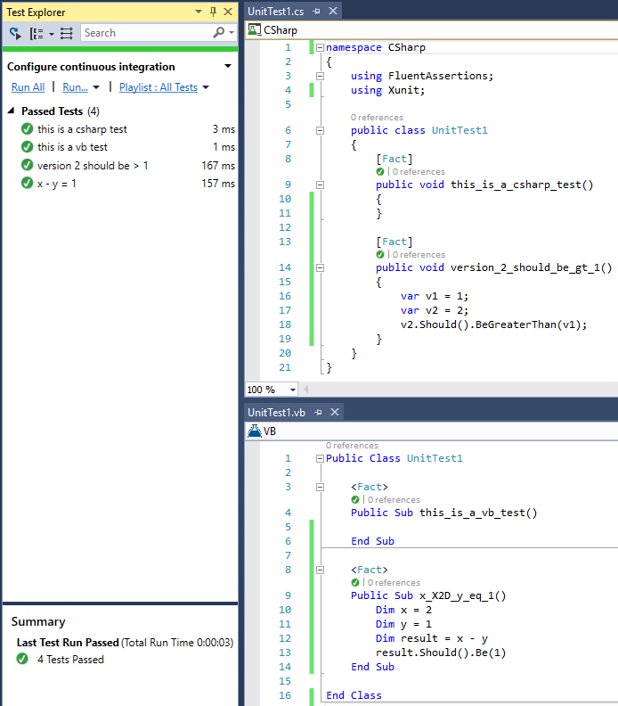

# More xUnit Templates
A collection of Visual Studio .NET project templates, item templates, and code snippets for xUnit.net.

These templates leverage a fork of xUnit.net that provides additional test case method display options as described in:
* xUnit.net Issue [#759](https://github.com/xunit/xunit/issues/759) on GitHub
* xUnit.net Pull Request [#828](https://github.com/xunit/xunit/pull/828) on GitHub

If or when the pull request is integrated into the main xUnit.net source tree, these templates will be updated to reflect
those packages. All of the forked libraries are identical to the official libraries with the exception of the test case
method display extensions and the alternate NuGet package identifiers. They are compatible with all other xUnit.net tooling,
including the official xUnit.net Visual Studio test runner.

## Supported Languages
The current templates and code snippets support:

* Visual C#
* Visual Basic .NET

## Project Template
The project template creates a new, empty **Unit Test Project** for the target language with the following configuration:

* References to xUnit.net
* References to the xUnit.net Visual Studio test runner
* An application configuration (app.config) with the default test method display options

The project template will be located in the **Test** template group with the name **xUnit Test Project (More)**.

## Item Template
The following item templates are provided:

* A new, empty unit test class for the target language with the appropriate namespaces
* An empty definition of class data for a theory test case

The item template will be located in the **Test** template group with the name **xUnit Test (More)**.

## Code Snippets
The following code snippets are provided for adding various test methods:

* **fact** - Creates a fact test case
* **afact** - Creates an asynchronous fact test case
* **theory** - Creates a theory test case with inline data
* **atheory** - Creates an asynchronous theory test case with inline data
* **mdata** - Creates a new property to provide member data for a theory test case
* **theorym** - Creates a theory test case with member data
* **atheorym** - Creates an asynchronouys theory test case with member data
* **theoryc** - Creates a theory test case with class data
* **atheoryc** - Creates an asynchronouys theory test case with class data

# Test Case Display Name Enhancements
The following outlines the test case display name enhancements added to xUnit.net. These
extensions are included in the provided templates. The extensions are also available as
standalone NuGet packages with the package identifier **more.xunit**.

## Overview

The **DisplayName** property for facts and theories are great for making tests really
easy to read, but after explicitly defining them for a couple of years now, it feels
like Xunit could do better at providing an automatic, display names using
*Convention over Configuration (CoC)*.

For example, many developers write tests as:
```C#
public class MyTestClass
{
  [Fact]
  public void verify_that_something_does_the_right_thing() {  }
}
```

What the author intended the test to say is "verify that something does the right thing".
This is a limitation in the source language as opposed to an issue with Xunit.  Some Xunit
extensions, like that for Visual F#, allow you to write tests in exactly this way.

## Enhancements
The following enhancements have been made to support the automatic *pretty* display name
of classes and methods that follow a well-defined convention. In doing so, display names
become easier and more natural to read.

The following rules and conventions apply:
* The **DisplayName** property still overrides the default, formatted display name
* The convention rules are applicable across programming languages
* The underscore ('_') character is always replaced with a space
* The following substitution tokens are supported if they have an underscore ('_') to both
  sides, appear as the first token, or appear as the last token. Token matches are
  case-insensitive. These are the same tokens supported in Windows PowerShell:
   * **eq** '='
   * **ne** '!='
   * **lt** '<'
   * **le** '<='
   * **gt** '>'
   * **ge** '>='
* An ASCII escape sequence can be specified using **X[HH]**, where the sequence is uppercase
  and **H** is a valid hexadecimal character
* A Unicode escape sequence can be specified using **U[HHHH]**, where the sequence is uppercase
  and **H** is a valid hexadecimal character

## Examples
The following outlines a few basic usage examples:

```C#
public class Example
{
  [Fact]
  public void unit_tests_are_awesomeX21_U263A(){ }

  [Fact]
  public void api_version_1_should_be_lt_2(){ }

  [Fact]
  public void X3DX3D_operator_overload_should_be_equivalent_to_Equals_method(){ }

  [Fact]
  public void X27stuffedX27_should_not_be_ambiguous_X27stUFFEDX27(){ }

  [Fact]
  public void X27maxed_outX27_should_not_be_ambiguous_with_X27maXED_outX27(){ }

  [Fact]
  public void TestNameShouldRemainUnchanged(){ }

  [Fact( DisplayName = "custom test name" )]
  public void CustomTestName(){ }

  [Fact( DisplayName = "an explicit display name overrides the convention" )]
  public void An_Explicit_DisplayName_Overrides_The_Convention(){ }
}
```
The display name for the facts are:
* unit tests are awesome! ☺
* api version 1 should be < 2
* == operator overload should be equivalent to Equals method
* 'stuffed' should not be ambiguous with 'st￭'
* 'maxed out' should not be ambiguous with 'maí out'
* TestNameShouldRemainUnchanged
* custom test name
* an explicit display name overrides the convention

In *Behavior-Driven Development* (BDD) with XUnit, the **Given, When, Then (GWT)** approach
is also largely popular and this type of naming support would make these tests significantly
easier to read by convention. For example:

```C#
namespace Given
{
  public class a_version_number
  {
    [Fact]
    public void _when_it_equals_1x2C_then_it_should_be_less_than_2() {}
  }
}
```
The display output is **"Given.a version number. when it equals 1, then it should be less than 2"**.
Note that the display name has two periods ('.') in it.  These remain due to the current limitation
as described in Issue #524. The compromise of a period over a comma in this context is minor and
doesn't sacrifice readability or intention. If or when the issue is ever addressed holistically,
the naming semantics could be based purely on class and method names. In my experience and option,
few developers are concerned with including the namespace in their test case names or descriptions.

# Screenshots
